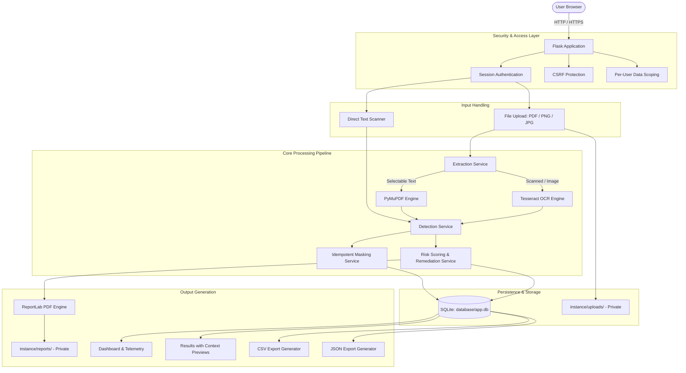

# Data Leak Guardian

**Data Leak Guardian** is a privacy-first, on-premises sensitive data inspection and privacy risk scoring application. It identifies Personally Identifiable Information (PII), financial account details, national identifiers, and contact records within uploaded files (PDFs, images) and raw text snippets.

The application calculates an explainable, deterministic privacy-risk score, renders safely masked findings alongside contextual previews, provides actionable remediation safeguards, and generates downloadable audit reports in PDF, CSV, and JSON formats.

---

## Table of Contents

- [Problem Statement & Objective](#problem-statement--objective)
- [Key Features](#key-features)
- [Detection Categories & Scoring Methodology](#detection-categories--scoring-methodology)
- [Technology Stack](#technology-stack)
- [System Architecture](#system-architecture)
- [Directory Structure](#directory-structure)
- [Installation & Setup](#installation--setup)
- [Running the Application](#running-the-application)
- [Testing Suite](#testing-suite)
- [Usage Guide](#usage-guide)
- [Security & Privacy Posture](#security--privacy-posture)
- [Known Limitations](#known-limitations)
- [Future Improvements](#future-improvements)

---

## Problem Statement & Objective

### The Problem
Organizations and individuals routinely handle invoices, identity documents, application forms, communication logs, and customer support tickets. These assets frequently contain unredacted sensitive personal and financial identifiers. Manual document auditing is time-consuming, prone to human error, and fails when dealing with image-based documents or scanned PDFs.

### The Objective
Data Leak Guardian provides a self-contained, local DLP (Data Loss Prevention) auditing tool that:
1. Operates entirely locally without sending data to external APIs, cloud LLMs, or third-party servers.
2. Performs OCR and rule-based pattern detection across document and snippet streams.
3. Automatically redacts and masks sensitive values before persistence or presentation.
4. Generates audit artifacts (PDF, CSV, JSON) and provides clear remediation guidelines.

---

## Key Features

- **Document & Image Scanner**:
  - Supports PDF documents (`application/pdf`) and images (`image/png`, `image/jpeg`).
  - Enforces a 5 MB file size limit and validates file signatures.
  - Native text extraction via PyMuPDF with automatic Tesseract OCR fallback for scanned pages.
- **Direct Text / Snippet Scanner**:
  - In-browser text area for pasting emails, log outputs, SQL records, or draft notes.
  - Optional custom reference labeling.
- **8 Supported Sensitive-Data Categories**:
  - Aadhaar (UIDAI), PAN (Income Tax), Bank Accounts, IFSC codes, Phone numbers, Email addresses, Date of Birth (DOB), and Postal PIN codes.
- **Explainable Privacy Risk Scoring**:
  - Deterministic 0–100 risk score based on category weights.
  - Deduplication of identical finding values.
  - Categorization into four standardized risk levels: Low, Moderate, High, and Critical.
- **Safe Contextual Findings & Previews**:
  - Extracts safe surrounding text windows around detected items.
  - Idempotent masking ensures raw PII is never exposed in the UI, contextual snippets, logs, or reports.
- **Actionable Remediation Guidance**:
  - Contextual redaction recommendations aligned with UIDAI, RBI, and IT Act standards.
- **Multi-Format Export Engine**:
  - Downloadable executive PDF Privacy Reports generated via ReportLab.
  - Machine-readable CSV and JSON exports with structured findings metadata and masked values.
- **Privacy Dashboard & KPI Telemetry**:
  - Live statistics: total scans, risk-level distributions, and category breakdown counters.
  - Recent scan audit history table with quick actions.
- **Searchable Scan History Repository**:
  - Search by document filename.
  - Filter by risk level (Low, Moderate, High, Critical).
  - Sort by date, risk score, or finding count.
  - 20-item pagination with accessible deletion confirmation modals.
- **Authentication & User Scoping**:
  - Per-user account isolation with Werkzeug password hashing.
  - Cross-user authorization barriers on all scans, reports, and exports (unauthorized access returns HTTP 404).
  - Account Profile view with current-password verification for password updates.
  - Full CSRF protection and secure session management.

---

## Detection Categories & Scoring Methodology

### Supported Categories

| Category | Description | Pattern / Context Requirement | Masking Format |
| :--- | :--- | :--- | :--- |
| **Aadhaar** | 12-digit Indian national identity number | 12 digits (with optional spaces) + UID/Aadhaar keyword context | `XXXX XXXX 1234` |
| **PAN** | 10-character Permanent Account Number | 5 uppercase letters, 4 digits, 1 uppercase letter | `XXXXX1234F` |
| **Bank Account** | Financial account numbers | 9–18 digits + account context keywords | `XXXXXXXX1234` |
| **IFSC** | 11-character Indian Financial System Code | 4 letters, 0, 6 alphanumeric characters | `XXXX0001234` |
| **Phone** | Mobile and landline numbers | Indian phone patterns (+91, 10-digit) + contact context | `XXXXXX4321` |
| **Email** | Standard email addresses | Standard RFC 5322 format | `us***@domain.com` |
| **Date of Birth** | DOB records | Standard date formats (DD/MM/YYYY, etc.) + birth context | `XX/XX/1990` |
| **PIN Code** | Indian postal codes | 6 digits + PIN/postal/ZIP context | `XXXX01` |

### Scoring Formula

Scores are calculated additively based on unique findings (identical `(category, value)` matches are counted only once), capped at 100 points:

$$\text{Total Score} = \min\left(100, \sum_{\text{unique categories}} \text{Weight}\right)$$

| Category | Configured Weight |
| :--- | :---: |
| Aadhaar | 30 pts |
| PAN | 20 pts |
| Bank Account | 25 pts |
| IFSC | 10 pts |
| Phone | 15 pts |
| Email | 10 pts |
| Date of Birth | 15 pts |
| PIN Code | 20 pts |

### Risk Level Boundaries

| Score Range | Risk Level | Severity Color Indicator |
| :---: | :--- | :--- |
| **0 – 24** | **Low** | Success Green (`#059669`) |
| **25 – 49** | **Moderate** | Warning Amber (`#d97706`) |
| **50 – 74** | **High** | Alert Orange (`#ea580c`) |
| **75 – 100** | **Critical** | Danger Red (`#dc2626`) |

---

## Technology Stack

Verified against [`requirements.txt`](requirements.txt) and the application source code:

- **Core Runtime**: Python 3.12
- **Backend Web Framework**: Flask 3.0.3, Werkzeug 3.0.3
- **Form & CSRF Security**: Flask-WTF 1.2.2
- **Database**: SQLite 3 (built-in Python driver)
- **PDF Extraction**: PyMuPDF 1.28.2 (`fitz`)
- **Image Processing & OCR**: Pillow 12.3.0, pytesseract 0.3.13, Tesseract OCR Engine
- **Report Generation**: ReportLab 5.0.1
- **Frontend & Styling**: Vanilla HTML5, CSS3, JavaScript (ES6+), self-hosted Bootstrap 5.3.3 (zero external CDN dependencies)
- **Testing**: pytest 8.3.3

---

## System Architecture



### Module Responsibilities

- **`app/routes/web.py`**: Handles view endpoints, authentication, file uploads, text scans, export dispatching, search/filtering, and profile updates.
- **`app/services/detection_service.py`**: Executes deterministic regex pattern detection with context heuristics; generates context preview snippets.
- **`app/services/extraction_service.py`**: Extracts text from PDFs via PyMuPDF; runs OCR via pytesseract when pages lack text or for image inputs.
- **`app/services/risk_service.py`**: Calculates total scores, determines risk tiers, outputs score explanations, and matches remediation rules.
- **`app/services/report_service.py`**: Generates styled PDF privacy audit reports containing finding tables, telemetry, and remediation checklists.
- **`app/services/upload_service.py`**: Sanitizes filenames, checks extensions, validates file signatures, and isolates files in private directories.
- **`app/utils/masking.py`**: Implements idempotent masking functions for all eight sensitive categories.
- **`app/database.py`**: Database connection lifecycle management and additive dynamic migrations.

---

## Directory Structure

```text
DataLeakGuardian/
├── app/
│   ├── routes/
│   │   ├── __init__.py
│   │   └── web.py                 # Application routes & view controllers
│   ├── services/
│   │   ├── __init__.py
│   │   ├── detection_service.py   # Pattern matchers & context extractors
│   │   ├── extraction_service.py  # PyMuPDF text & Tesseract OCR pipelines
│   │   ├── report_service.py      # ReportLab PDF report generation
│   │   ├── risk_service.py        # Risk scoring & remediation rules
│   │   └── upload_service.py      # Secure file storage & validation
│   ├── static/
│   │   ├── css/
│   │   │   ├── bootstrap.min.css  # Self-hosted Bootstrap 5.3.3
│   │   │   └── style.css          # Guardian Design System stylesheet
│   │   └── js/
│   │       ├── bootstrap.bundle.min.js
│   │       ├── history.js         # Delete confirmation handlers
│   │       └── upload.js          # Drag-and-drop & progress handlers
│   ├── templates/
│   │   ├── _navigation.html       # Global navigation bar & profile links
│   │   ├── dashboard.html         # KPI cards & recent scans
│   │   ├── history.html           # Audit logs, search, filters & exports
│   │   ├── login.html             # User authentication
│   │   ├── profile.html           # Account info & password management
│   │   ├── register.html          # Account registration
│   │   ├── result.html            # Score gauge, snippets & remediations
│   │   └── upload.html            # File upload & direct text scanner
│   ├── utils/
│   │   ├── __init__.py
│   │   └── masking.py             # Idempotent PII masking utilities
│   ├── __init__.py                # Flask application factory & CSP headers
│   └── database.py                # SQLite connection & schema initialization
├── database/
│   ├── app.db                     # Local SQLite database (git-ignored)
│   └── schema.sql                 # Base table definitions (users, documents)
├── instance/                      # Runtime private storage (git-ignored)
│   ├── reports/                   # Generated PDF audit reports
│   ├── uploads/                   # Stored uploaded documents
│   └── secret_key.txt             # Auto-generated Flask secret key
├── tests/
│   ├── auth_helpers.py            # Test authentication fixture helpers
│   ├── test_authentication.py     # Auth, session & CSRF tests
│   ├── test_detection_service.py  # Regex & false-positive tests
│   ├── test_extraction_service.py # PyMuPDF & OCR extraction tests
│   ├── test_integration_pipeline.py # End-to-end analysis tests
│   ├── test_phase4_features.py    # Text scan, CSV/JSON, filter tests
│   ├── test_report_service.py     # PDF generation & masking tests
│   ├── test_risk_service.py       # Score weighting & boundary tests
│   ├── test_scan_history.py       # History, deletion & dashboard tests
│   └── test_security_hardening.py # File limits, path traversal & CSP tests
├── .gitignore                     # Git exclusion rules
├── README.md                      # Project documentation
├── requirements.txt               # Pinned Python package dependencies
└── run.py                         # Local development execution entrypoint
```

---

## Installation & Setup

### Prerequisites

1. **Python 3.12** installed on your system.
2. **Tesseract OCR**:
   - **Windows**: Download and install the Tesseract installer (e.g. `C:\Program Files\Tesseract-OCR\tesseract.exe`). Ensure `tesseract.exe` is in your system `PATH` or at the default installation path.
   - **Ubuntu/Debian**:
     ```bash
     sudo apt update && sudo apt install -y tesseract-ocr
     ```
   - **macOS**:
     ```bash
     brew install tesseract
     ```

### 1. Clone & Navigate to Project

```bash
cd D:\DataLeakGuardian
```

### 2. Configure Virtual Environment

On Windows (PowerShell):
```powershell
python -m venv .venv
.\.venv\Scripts\Activate.ps1
python -m pip install --upgrade pip
pip install -r requirements.txt
```

On Linux / macOS:
```bash
python3 -m venv .venv
source .venv/bin/activate
pip install --upgrade pip
pip install -r requirements.txt
```

### 3. Database Initialization

Database initialization occurs automatically when the Flask application boots. The application factory runs `init_db()` from `app/database.py`, which executes `database/schema.sql` if tables do not exist and applies additive column migrations (`user_id`, `total_score`, `risk_level`, `finding_count`, `findings_json`, `risk_json`, `report_name`). Existing data in `database/app.db` is preserved.

---

## Running the Application

### Development Server

Start the application with:
```powershell
.\.venv\Scripts\python run.py
```

The application will bind to the local loopback address:
```text
 * Running on http://127.0.0.1:5000
```

Open your browser and navigate to:
```text
http://127.0.0.1:5000
```

### Secret Key Configuration

By default, the application checks for the `FLASK_SECRET_KEY` environment variable. If absent, it persists a random 64-character secret key locally in `instance/secret_key.txt` with restricted file permissions (`0o600`).

To specify a custom secret key:
```powershell
$env:FLASK_SECRET_KEY = "your-custom-production-entropy-key"
.\.venv\Scripts\python run.py
```

---

## Testing Suite

The project includes an automated test suite with **83 tests** covering all authentication, detection, scoring, extraction, security hardening, and export features.

Run the test suite with:
```powershell
.\.venv\Scripts\python -m pytest -v
```

Expected output:
```text
============================= 83 passed in 12.12s =============================
```

---

## Usage Guide

1. **Register / Log In**:
   - Access `http://127.0.0.1:5000/register` and create an account.
   - Sign in at `/login`.
2. **Scan a Document**:
   - Navigate to **New Scan** in the navigation bar.
   - On the **File Upload** tab, drag and drop a PDF, PNG, JPG, or JPEG file (under 5 MB).
   - Click **Analyze document**.
3. **Scan Direct Text / Snippets**:
   - Switch to the **Direct Text Scanner** tab on the scan page.
   - Provide an optional label (e.g. `Customer Support Note`) and paste raw text.
   - Click **Analyze text snippet**.
4. **Inspect Analysis Results**:
   - Review the total risk score (0–100), risk badge, category contribution breakdown, and explanation list.
   - View the findings table showing masked sensitive values, confidence levels, and context snippets.
   - Review the **Actionable Remediation & Redaction Guidance** checklist.
5. **Export Findings**:
   - Click **Export Findings** in the top action header to download the scan findings as a CSV or JSON file.
   - Click **Download Privacy Report** to generate a formatted PDF audit report.
6. **Search & Audit Scan History**:
   - Open **Scan History** to view all completed scans.
   - Filter records by filename search query, risk severity tier, or sort order.
7. **Manage Profile & Security**:
   - Click on your user avatar pill in the top navigation to view account information or update your account password.

---

## Security & Privacy Posture

- **Local Execution**: Document text extraction, OCR, and pattern detection execute entirely on the local host machine. No network requests are made to third-party APIs.
- **Storage Redaction**: Sensitive PII values are masked prior to database persistence and report generation. Raw PII is not retained in database records.
- **Account Isolation**: All queries enforce ownership checks (`WHERE id = ? AND user_id = ?`). Users cannot view, download, export, or delete records belonging to other users.
- **CSRF Defense**: All POST endpoints require valid CSRF tokens managed by Flask-WTF.
- **Content Security Policy**: Enforces strict CSP headers:
  ```http
  Content-Security-Policy: default-src 'self'; frame-ancestors 'none'; object-src 'none'; base-uri 'self'
  ```
  All styling and scripts (including Bootstrap 5.3.3) are self-hosted locally within `app/static/`.
- **Security Notice & Best Practices**:
  > [!WARNING]
  > Pattern-based masking and automated detection cannot guarantee identification of all possible PII variations or unstructured disclosures.
  > Do not upload real, unredacted classified or high-risk production records to unverified environments.
  > For production multi-user environments, execute Flask behind an enterprise WSGI application server (such as Waitress or Gunicorn) behind a TLS/HTTPS reverse proxy.

---

## Known Limitations

1. **Deterministic Pattern Rules**: The detection engine utilizes regular expressions and keyword proximity heuristics. It does not run natural language processing (NLP) models and may fail on non-standard phrasing or unusual number formatting.
2. **OCR Dependency**: Scanned PDF and image OCR rely on an external Tesseract installation. Text extraction quality depends on source resolution, contrast, and standard font geometry.
3. **No Multi-Factor Authentication**: Authentication relies on username/password credentials. Multi-factor authentication (MFA) and automated password reset workflows via email are not currently implemented.
4. **Single-Node SQLite Storage**: SQLite is designed for lightweight and single-instance deployments. Concurrent high-throughput write operations should use a dedicated database engine (e.g., PostgreSQL).

---

## Future Improvements

- [ ] Support for additional document types (Microsoft Word `.docx`, Excel `.xlsx`, CSV files).
- [ ] Named Entity Recognition (NER) utilizing lightweight local open-source transformer models (e.g. spaCy).
- [ ] Configurable custom regex pattern definition via user interface.
- [ ] Webhook alerts and scheduled directory watch capabilities for automated local folder scanning.
- [ ] Role-Based Access Control (RBAC) supporting Auditor, Admin, and User roles.

---

## License

This project is licensed under the MIT License. See `LICENSE` for details.
